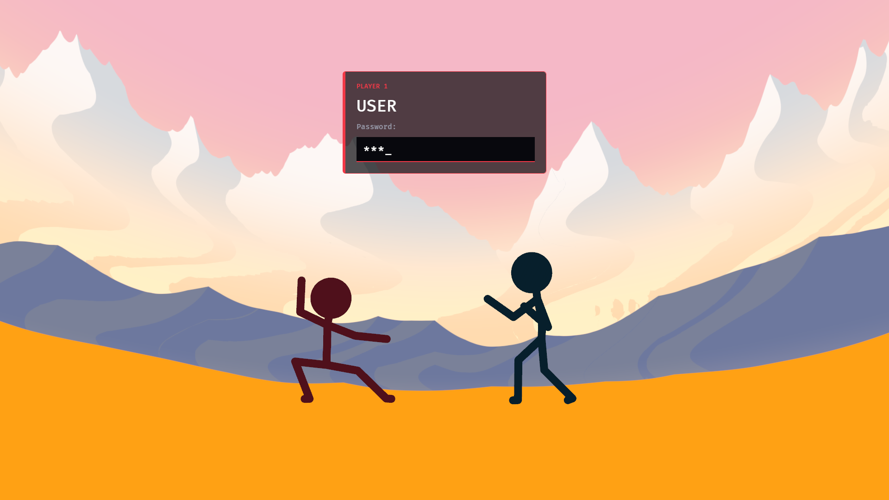

# FG Greeter

Figthing game greeter - A Linux greeter with a fighting game animation.

The goal is to have a fun greeter where entering your password simulate a fighting game experience. 
When you press any characters, your fighter will hit the opponent, comboing if you are typing fast enough.
If you provided the correct password, you will deliver a finishing blow and enter your session.
Otherwise, you will be countered and a new round starts !

To use this greeter, [see the installation guide](#install)



### Status

The functionnal part of logging in is working, with a clean state machine handling greetd.
The state machine sends animations events that are then used to run the animation.

I am no artist, and both the background and my animations are terrible.
I'd like to make them way better, and any help is appreciated !

This greeter is currently using bevy, and while it's fine for a quick result, I'd like to migrate away from it.
The issue is that Bevy has a tendency to panic, and we can't let a greeter panic when something is wrong.
I would like a more robust solution, and since the visual part is super simple anyway (only one object),
I'd like to move to a simpler way of rendering / animating the scene.

### Contributing 

Anyone is welcome to help, for the code or art. 
Currently, the code is fully working, so the art and animations is the main pain point of this project.

#### How does it works ?

The models and animations are exported as a single glb file from blender.
The greeter will attempt to load named animations:

- "Idle" -> idle animation
- "Hit.*" -> hit animation

all hits animations will be loaded in, and when a hit is launched, a random hit animation clip is picked.

#### What's missing ?

Currently, there is support for the windup, finisher, and counter. The idea is that when the password is entered,
the character enters a windup state while greetd validates the inputs. If the password is correct,
the fighter then delivers a final blow, ideally with nice impact frames, allowing to do a transition to black 
before launching the user session. If the input is wrong, the opponent can counter the windup, and the round restarts.

All animations for the windup / finisher / coeunter are missing, as well as a reset and enter animation.

These are currently not loaded either, but I would be more than happy to do the missing work on the code side !

### Install

#### NixOS

To use this on NixOS, you have to build it from source manually:

```nix
{ lib, pkgs }:
let
  fgGreeterSrc = pkgs.fetchFromGitHub {
    owner = "VirgileHenry";
    repo = "fggreeter";
    rev = "<commit>";
    sha256 = "<git sha>";
  };

  # winit/wgpu dlopen these at runtime
  ldLibPath = lib.makeLibraryPath [ pkgs.wayland pkgs.libxkbcommon pkgs.vulkan-loader ];
  ldPrefix = "--prefix LD_LIBRARY_PATH : ${ldLibPath}";
  assetFolder = "--set BEVY_ASSET_ROOT $out/share/fggreeter";
  postFixup = "wrapProgram $out/bin/fggreeter ${ldPrefix} ${assetFolder}";
in
pkgs.rustPlatform.buildRustPackage {
  pname = "fggreeter";
  version = "0.1.0";
  src = fgGreeterSrc;
  cargoHash = "<cargo lock sha>";
  nativeBuildInputs = [
    pkgs.pkg-config
    pkgs.makeWrapper
  ];
  buildInputs = [
    pkgs.wayland
    pkgs.libxkbcommon
    pkgs.udev
    pkgs.alsa-lib
  ];
  meta = {
    description = "Fighting Game Greeter";
  };
  postInstall = ''
    mkdir -p $out/share/fggreeter
    cp -r assets $out/share/fggreeter/
  '';
  postFixup = postFixup;
}
```

Then, the greeter uses cage to run a single window app at startup:

```nix
{ lib, config, pkgs, ... }:
let
  # Custom greeter that is a rust package to be built from source
  fgGreeter = import ./fggreeter.nix { lib = lib; pkgs = pkgs; };

  # WARNING: only use this if you have a custom layout
  layout = "XKB_DEFAULT_LAYOUT=fr";
  greeterEnv = "${pkgs.coreutils}/bin/env ${layout}";
  cage = "${pkgs.cage}/bin/cage -s -m last --";
  # The log file part can be removed, but it's useful to debug the greeter
  greeter = "${fgGreeter}/bin/fggreeter --user eclipse --command start-hyprland --log-file /var/log/fggreeter/fggreeter.log";
in
{
  services.displayManager.gdm.enable = false;
  services.greetd = {
    enable = true;
    settings.default_session = {
      command = lib.concatStringsSep " " [ greeterEnv cage greeter ];
      user = "greeter";
    };
  };
  systemd.tmpfiles.rules = [ "d /var/log/fggreeter 0755 greeter greeter -" ];
}
```

Since this uses bevy for now, it might take a few minutes to build.

#### Not NixOS

I'm using NixOS, and I have no clue on how to set up a custom greeter for other distros. Dig it up !

### License

The code is licensed under the [GNU GPL v3.0 or later](LICENSE).

The art (fighter models, animations and their `.blend` sources in `assets/` and `art/`)
is licensed under [CC BY-SA 4.0](LICENSE-ASSETS), © <your name>.
